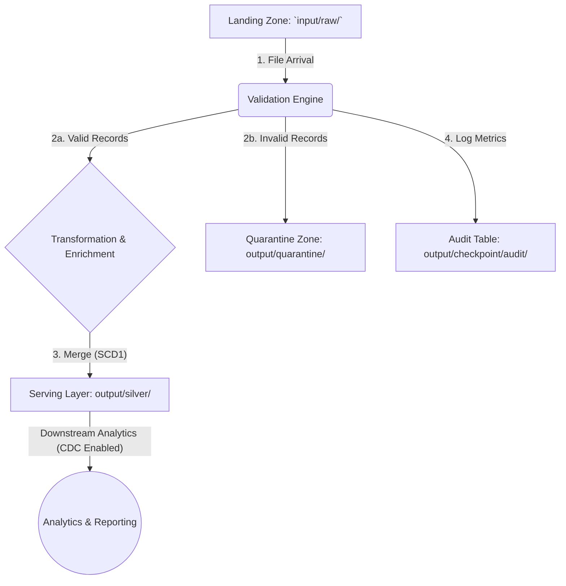

# Healthcare Data Ingestion Pipeline

The pipeline follows a multi-stage medallion architecture (Bronze/Landing -> Silver/Serving) to ensure data quality, auditability, and resilience.

## Architecture Diagram

## Data Flow Stages

1. **Landing (Bronze):** Raw, immutable CSV files from different clients land in the `input/raw/` directory. Files follow a `{client_id}_{creation_date}[Optional: _1 or _2 suffix].csv` naming convention.
2. **Validation:** A streaming process monitors the landing zone. Upon detecting a new file, it validates each record against a predefined Pandera schema.
3. **Quarantine:** Records failing validation are written to a `quarantine` Delta table. This isolates bad data for analysis without halting the pipeline.
4. **Transformation:** Valid records undergo standardization (e.g., phone numbers, dates) and enrichment.
5. **Audit:** Metadata for each processing job (file name, record counts, timestamps) is logged to a central audit Delta table.
6. **Serving (Silver):** Cleaned, transformed data is merged into the primary `silver` Delta table using an SCD Type 1 (upsert) pattern on the `member_id`. This ensures the table always contains the most recent member information and makes the pipeline idempotent.

## Scaling from 1 to 100 Clients

Scaling is achieved through configuration-driven processing, partitioning, autoloader for incremental file processing from object-store in cloud and leveraging Delta Lake's features.
1. **Partitioning:** If the primary `silver` Delta table is estimated to be more than `1TB` over time, we will partition it by `creation_date` and if the table is huge also may be by `client_id`. This provides physical data isolation, dramatically improves query performance for client-specific analytics, and simplifies data management tasks like GDPR-related data deletion.
2. **AutoLoader:** We will enable the AutoLoader in databricks to stream the recently added files only, to our application. We can even enable the notification option in autoloader to avoid scanning the whole path/dir for existing files.
3. **Metadata-Driven Configuration:** The pipeline will be driven by a central configuration store (e.g., YAML/Json files or a database table). Each client will have a configuration entry specifying:
   1. Source file path and schema location.
   2. Client-specific validation rules and transformation logic (This eliminates hardcoded logic and allows new clients to be onboarded by simply adding a new configuration file).
   3. If the final output schema can't be standardized across clients, then destination table and partitioning keys.
4. **Schema Evolution will be done as follows:**
   1. We will first start with our initial schema and register it in Schema Registry. We will use this schema and create the delta table beforehand writing any data. Delta Lake's schema evolution will be enabled on the serving table. This allows for non-breaking changes, such as adding new columns for a specific client, without downtime or complex migrations.
   2. Approach 1 (Can work for dev/qa): On first deployment we will pass this registered schema to Autoloader. All subsequent runs we let autoloader to infer type and detect schema changes and handle compatibility at `addNewColumns` level. Finally, when a schema evolved DF tries to write to Delta table, Delta Lake will identify if the schema is ok to evolve and Dataframe will be allowed to write, ending in new col addition or the job will fail with exception otherwise.
   3. Approach 2 (Preferred for prod): If we don't want auto evolution due to risks of upstream data provider, accidentally adding a poorly named or incorrectly typed column, we could use a staging inference script (no write) to detect proposed additions. Produce a diff, send out an alert and require approval, then update registry + Delta table. Then we can have a periodic script running which will reconcile the delta table and schema registry schema and update if not current.
   4. For any breaking changes, we will have to manually modify the updated schema in schema registry. Let it create the new column and then manually backfill the historic data for that new column and then once finished delete the old column.
5. **Backfills & Idempotency:** The use of a MERGE operation for loading data makes the pipeline idempotent. To perform a backfill, historical files can be dropped into the landing zone for processing. The pipeline will correctly update existing records and insert new ones without creating duplicates. (In order for this to work, we would need the creation_date in the file itself, instead of inferring it from filenames, because the historic files would need to be named with current_date for them to be pickedUp)

## Monitoring and Alerting

Monitoring will focus on data quality, pipeline health, and data freshness.
1. Data Quality Thresholds: Alerts will be triggered if the ratio of invalid-to-total records in a file exceeds a configurable threshold (e.g., 5%). This indicates a potential upstream data quality issue. The alert would be sent to a dedicated Slack channel or PagerDuty and include the `client_id, file_name`.
2. Freshness Checks: A scheduled job will run periodically (e.g., every 4 hours) to check the `ingestion_time` in the audit table for each active client. If no new data has been processed for a client within an expected timeframe, a "data delay" alert is triggered.
3. Failure Notifications: Any pipeline job failure (e.g., due to infrastructure issues, invalid configuration, or unhandled exceptions) will trigger an immediate high-priority alert to the on-call. The alert will contain the `run_id`, error logs.

## Compliance and PII Handling

Compliance with regulations like HIPAA is a core design principle, focusing on data protection and access control.
1. **PII Identification:** All columns containing Personally Identifiable Information (PII) or Protected Health Information (PHI) (e.g., `member_id, first_name, last_name, dob, zip, phone_number`) are explicitly identified and either generalized, tokenized, hashed with salt, use surrogate keys, etc. or if we have to store them as it we have to follow stricter HIPAA rules and act accordingly.
2. **Masking/Hashing Strategy:**
   1. Serving Layer (`silver`): PII data will be stored encrypted at rest and anonymized/removed if possible as explained above. Data will also be encrypted during transit. 
   2. Lower Environments (Dev/QA): We can store the completely anonymized data in QA/dev, without the mapping table or a dummy mapping table/vault key etc.
   3. Logs & Audits: No raw PII will be written to application logs. The audit table contains metadata only, not record-level PII.
3. **Least-Privilege Boundaries:** Access will be segregated. The ingestion service principal will have write access only to the `landing, quarantine`, and `silver` zones. Downstream analytics users will have read-only access to the `silver` table, potentially with column-level security to restrict access to sensitive PII fields based on their role.

## Assumptions

1. Client will dump 2 files per day on our local dir
2. The names of both files will contain the same prefix but will be distinctive by postfix, `_1.csv` and `_2.csv`
3. There are no business logic for aggregation at the moment, hence we stop the pipeline at silver layer. If business requirement arrises we will perform the aggregation in another `aggregate.py` file and store results in gold layer. I have already enabled CDF on silver layer, hence we will be able to do incremental processing for gold layer.

## How I used AI

I have used AI at various levels (used copilot for all the use cases):
1. Created `get_file_checksum` function in utils
2. Created the initial draft of test cases
3. Created all shell scripts for setup, lint_and_test, run_pipeline
4. Generated initial draft of README.md
5. Formalized and improved upon this DesignDoc.md file
 